# Help Desk Ticket Lab (Active Directory)

## 📌 Overview
> Hands-on help desk ticket simulation demonstrating real-world troubleshooting using Active Directory and Windows environments.

Each scenario is structured as a help desk ticket with:
- Issue
- Cause
- Investigation steps
- Resolution
- Verification

---

## 🧱 Lab Environment

- Hypervisor: VirtualBox  
- Windows Server 2019 (Domain Controller)  
- Windows 10 (Client Machine)  
- Domain: homelab.local  
- Internal lab network  

---

## 🎯 Objective

To simulate Tier 1 / Tier 2 help desk responsibilities including:
- Diagnosing user issues
- Troubleshooting Active Directory problems
- Resolving authentication and access control issues
- Validating fixes through testing

---

# 🎫 Ticket Scenarios

---

## 🎫 Ticket #1 — User Cannot Log Into Domain

### 🧾 Issue
User `testuser` is unable to log into the domain.

### 🔍 Cause
Incorrect DNS configuration on client machine preventing domain resolution.

### 🛠️ Investigation
- Verified IP configuration using `ipconfig /all`
- Tested domain resolution using `nslookup homelab.local`
- Confirmed DNS pointing to incorrect DNS (8.8.8.8) instead of domain controller

📸 **DNS misconfiguration on client**

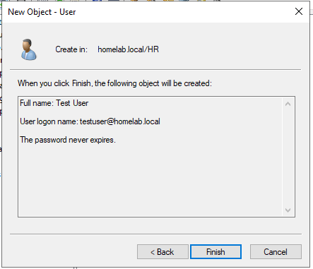

📸 **nslookup failing to resolve domain**

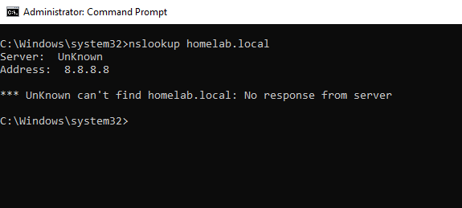

### ✅ Resolution
Updated DNS settings on CLIENT01 to point to Domain Controller:
- 192.168.10.10

📸 **DNS configuration corrected**

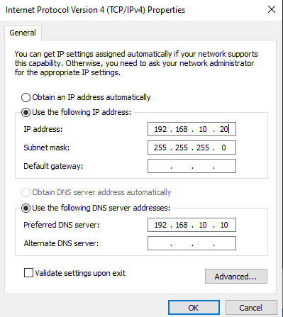

### ✔️ Verification
User successfully logged into domain after DNS correction.

📸 **Successful domain login**

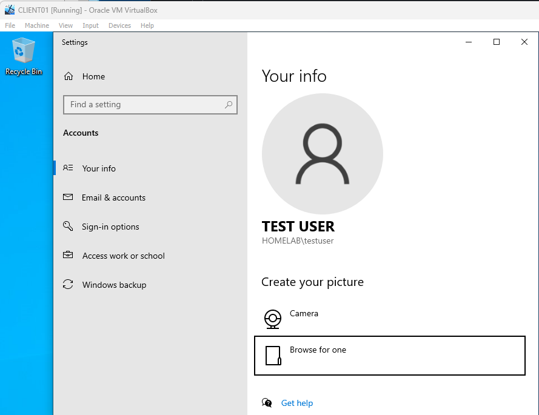

---

## 🎫 Ticket #2 — Access Denied to Shared Folder

### 🧾 Issue
User `jsmith` unable to access HR shared folder.

### 🔍 Cause
Missing security group permissions due to removed HR-Users group.

### 🛠️ Investigation
- Checked NTFS permissions on `C:\Departments\HR`
- Confirmed HR-Users group missing
- Verified access denied from client machine

📸 **Access denied when opening HR folder**

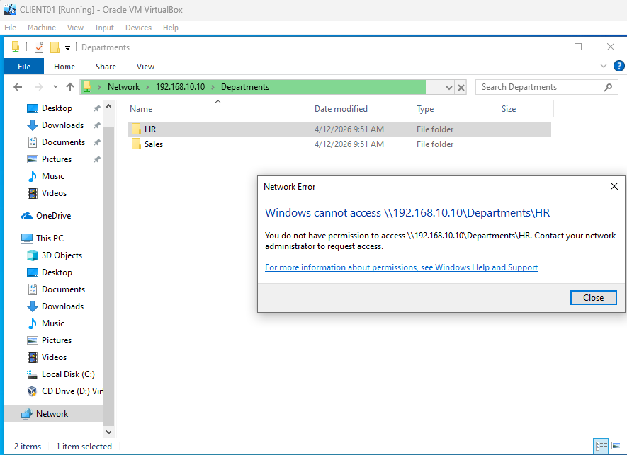

📸 **Security tab showing missing HR-Users group**

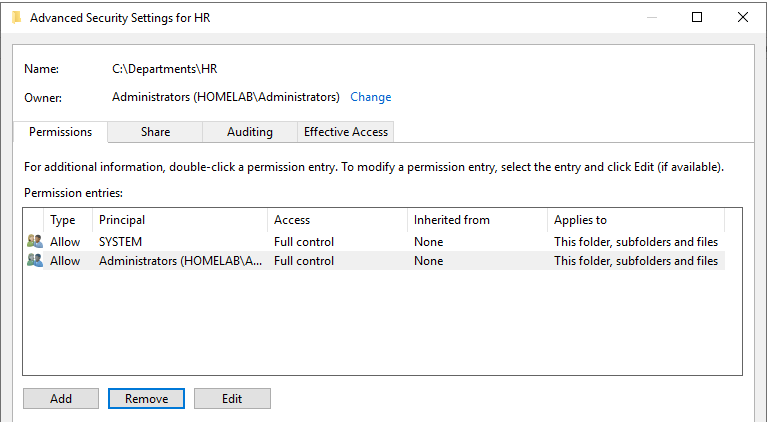

### ✅ Resolution
Re-added HR-Users group and assigned appropriate permissions.

📸 **HR-Users group re-added to folder permissions**

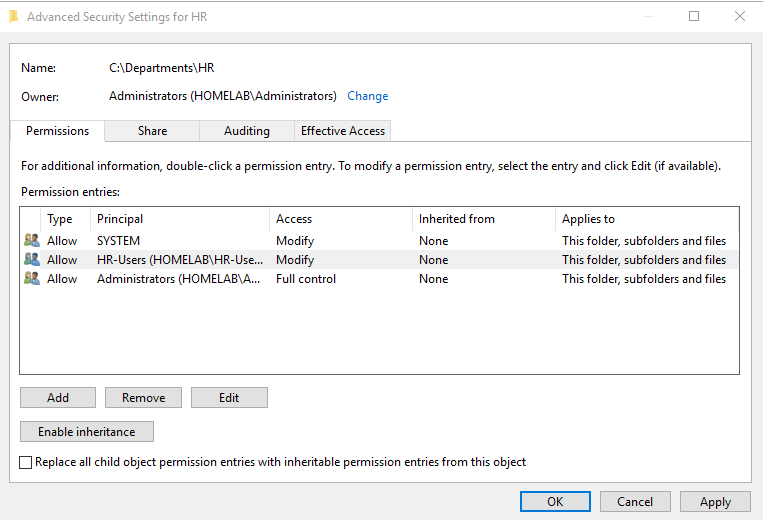

### ✔️ Verification
User regained access to HR folder from client machine.

📸 **Access to HR folder restored**

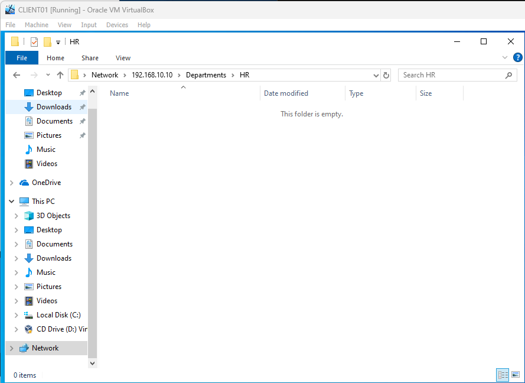

---

## 🎫 Ticket #3 — Account Lockout

### 🧾 Issue
User `mlopez` account locked after failed login attempts.

### 🔍 Cause
Multiple incorrect password attempts triggered lockout policy.

### 🛠️ Investigation
- Checked Active Directory Users and Computers
- Verified account lock status under user properties

📸 **Account locked error on login**

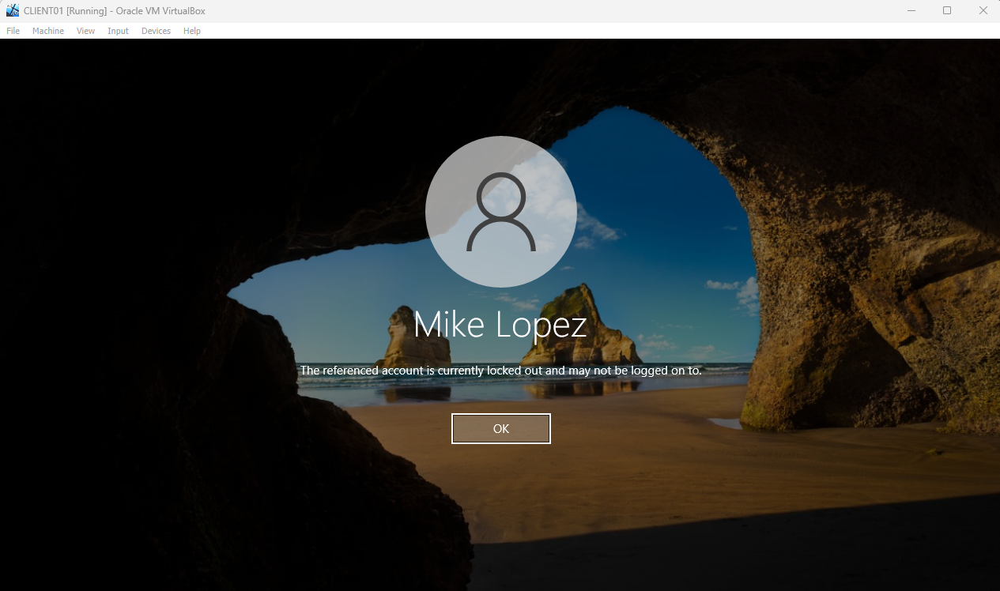

📸 **Account lockout confirmed in Active Directory**

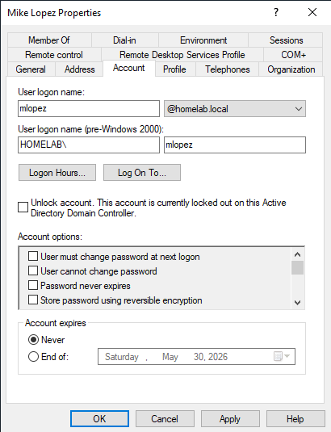

### ✅ Resolution
Unlocked user account in Active Directory.

📸 **Account unlocked in AD**

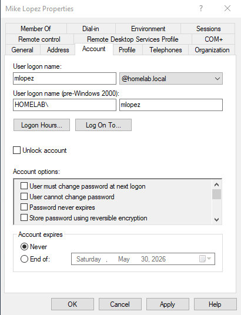

### ✔️ Verification
User successfully logged in after unlock.

📸 **Login restored successfully**

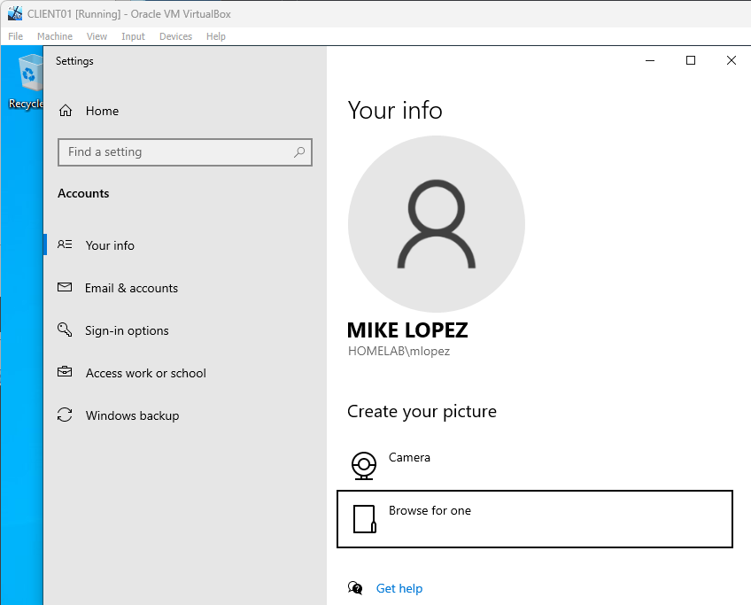
---

## 🎫 Ticket #4 — Client Not Joined to Domain

### 🧾 Issue
CLIENT01 unable to authenticate domain users.

### 🔍 Cause
Machine removed from domain and placed in WORKGROUP.

### 🛠️ Investigation
- Verified system membership settings
- Confirmed client machine was not joined to the domain

📸 **Client machine showing WORKGROUP instead of domain**

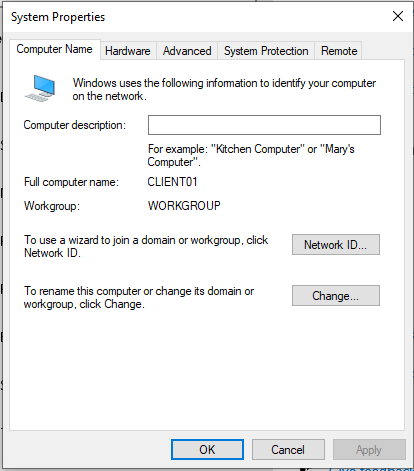

📸 **Domain login failure**

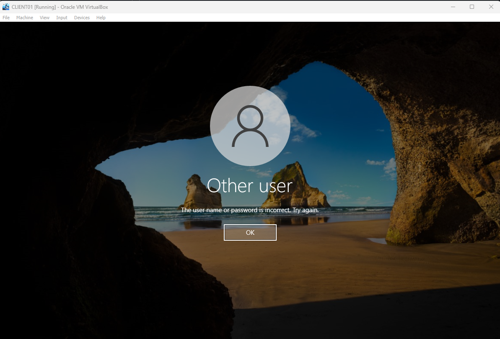

### ✅ Resolution
Rejoined CLIENT01 to `homelab.local` domain using domain admin credentials.

📸 **Domain join successful**

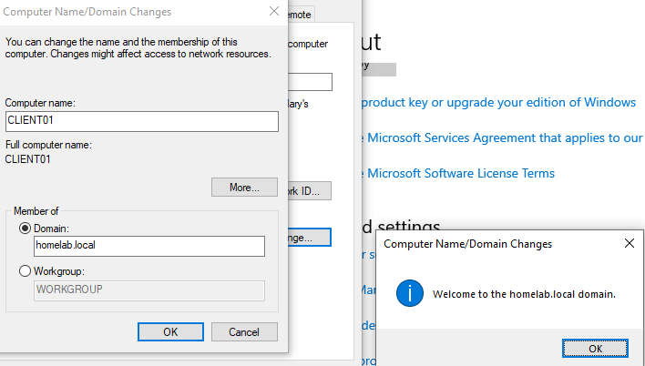

### ✔️ Verification
Domain login restored successfully.

📸 **Successful domain login**

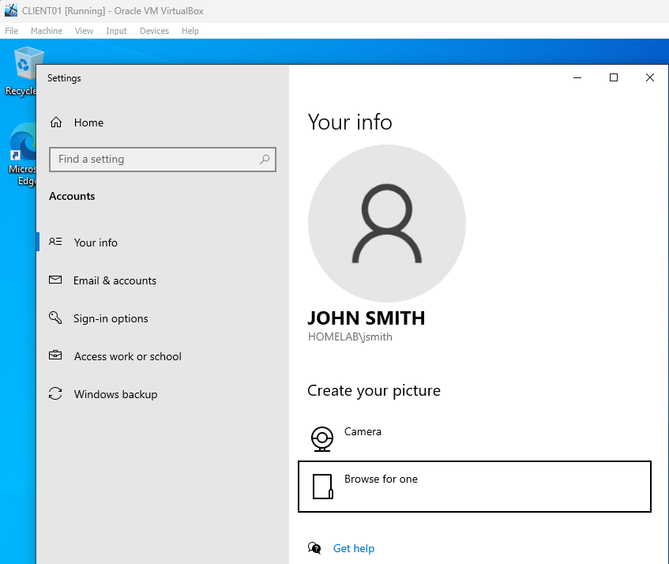

---

## 🎫 Ticket #5 — Network Connectivity Failure

### 🧾 Issue
Client unable to reach domain resources or services.

### 🔍 Cause
Incorrect IP configuration causing network isolation.

### 🛠️ Investigation
- Checked IP configuration via `ipconfig`
- Verified incorrect subnet assignment (192.168.50.x)

📸 **Incorrect IP configuration**

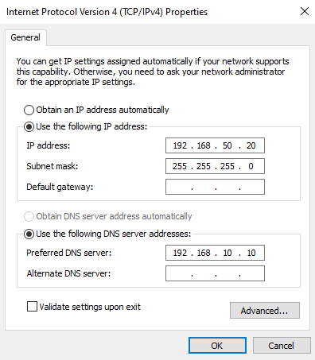

📸 **Ping failure to domain controller**

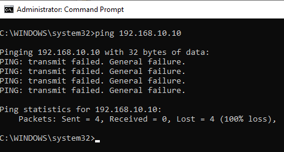

📸 **ipconfig showing incorrect network**

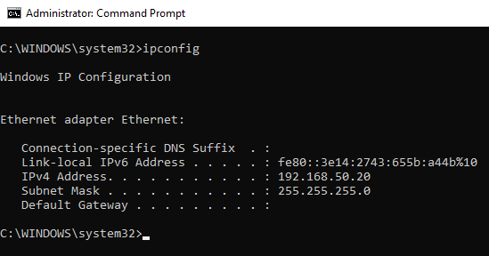

### ✅ Resolution
Restored correct network settings:
- IP: 192.168.10.20
- DNS: 192.168.10.10

📸 **Correct IP configuration restored**

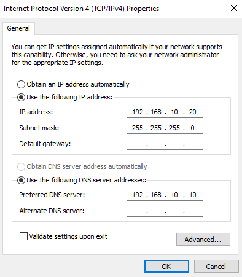

### ✔️ Verification
Network connectivity and domain access restored.

📸 **Successful ping to domain controller**

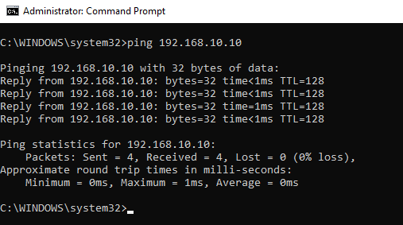

---

## 🧠 Key Takeaways

- Practiced real-world IT help desk troubleshooting workflows  
- Strengthened Active Directory and DNS troubleshooting skills  
- Learned how misconfigurations impact authentication and access  
- Applied structured problem-solving (Issue → Cause → Fix → Verify)
- Simulated common help desk tickets and applied structured troubleshooting methodology in a controlled lab environment

---

## 🔧 Skills Demonstrated

- Active Directory User Management  
- DNS Troubleshooting  
- Windows Networking  
- NTFS Permissions & Access Control  
- Account Lockout Management  
- Client/Server Domain Integration  

---

## 🚀 Future Improvements

- Implement Group Policy Objects (GPOs)  
- Automate user creation with PowerShell  
- Add ticket logging system (simulated Service Desk workflow)  
- Expand lab with multiple clients and departments
